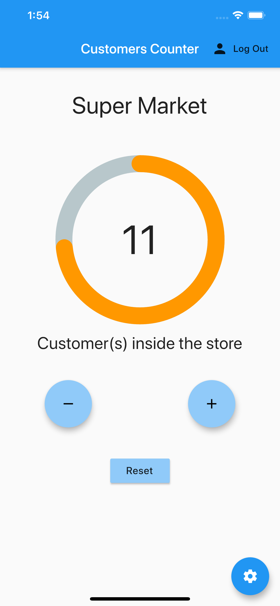
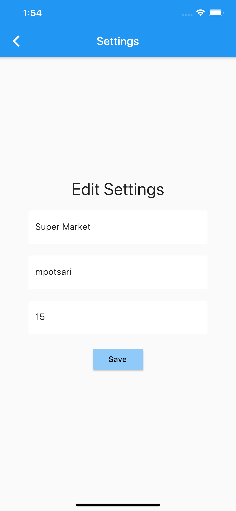
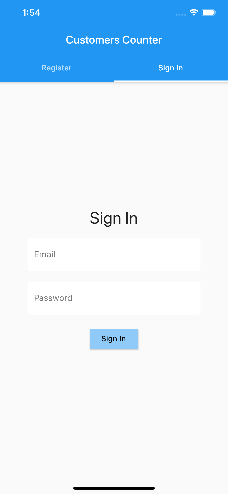

# counter_app

A simple counter to track the number of people inside a certain space.

Use this app if you want to keep track of the people who come in and out of a store, building, shop or mall in order to avoid big crowds. It will help you track customers without handing any numbers, tickets or coupons for the people in line.

#### App Screenshots

<table>
  <tr>
    <td>Main Screen</td>
     <td>Settings Screen</td>
     <td>Login Screen</td>
  </tr>
  <tr>
    <td></td>
    <td></td>
    <td></td>
  </tr>
 </table>
